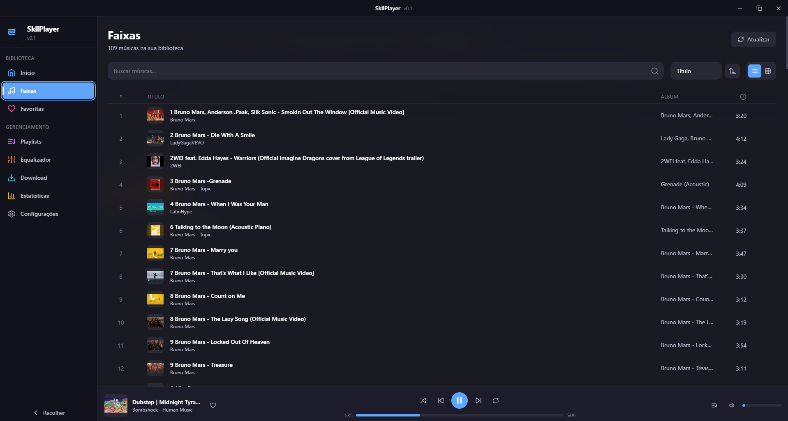
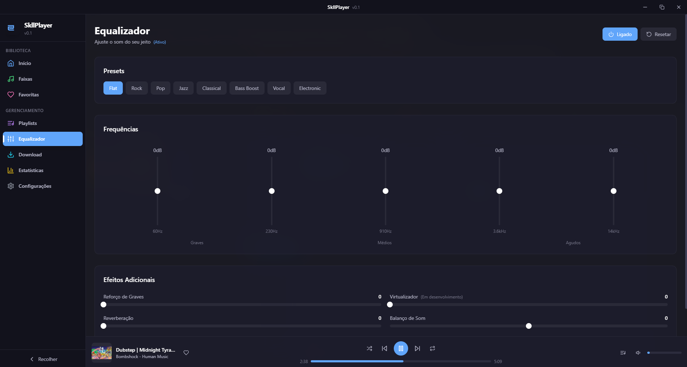
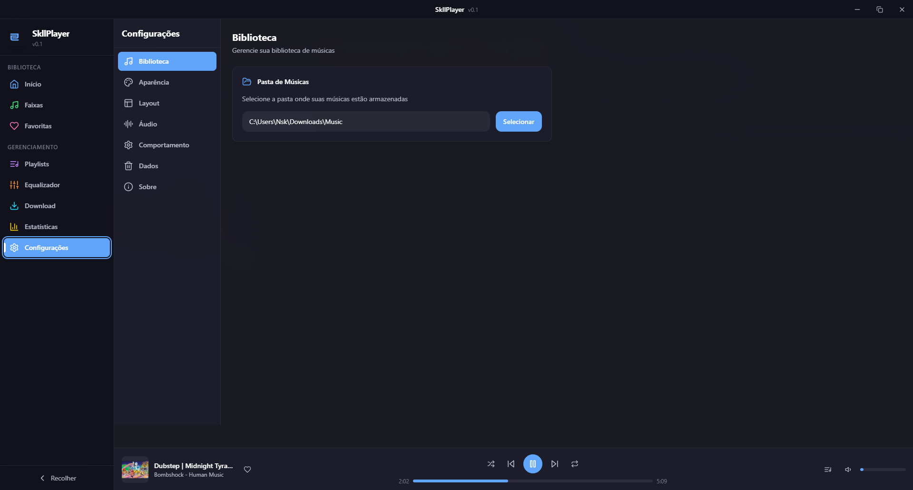

# SkllPlayer

Um player de música desktop moderno e elegante, inspirado no BlackPlayer para Android.


## Screenshots

<div align="center">

### Biblioteca de Faixas


### Equalizador


### Menu de Contexto


</div>

## Funcionalidades

### Player de Música
- Reprodução de áudio com suporte a MP3, FLAC, WAV, OGG, M4A, AAC, OPUS
- Controles completos: play, pause, next, previous, stop
- Barra de progresso com seek (click e drag)
- Controle de volume com scroll do mouse
- Modos de repetição: Off, All, One
- Modo shuffle (aleatório)
- Fila de reprodução com painel lateral
- Persistência de estado (última música e progresso)

### Biblioteca
- Escaneamento recursivo de pastas
- Extração automática de metadados e capas
- Busca e ordenação por título, artista, álbum, etc.
- Sistema de favoritos
- Estatísticas de reprodução

### Playlists
- Criar, renomear e deletar playlists
- Adicionar/remover músicas
- Menu de contexto completo

### Equalizador
- 5 bandas de frequência (60Hz, 230Hz, 910Hz, 3.6kHz, 14kHz)
- Reforço de graves (Bass Boost)
- Reverberação
- Balanço de som (Stereo Panner)
- Amplificador de volume
- Presets: Flat, Rock, Pop, Jazz, Classical, Bass Boost, Vocal, Electronic

### Download de Músicas (YouTube)
- Integração com yt-dlp
- Busca no YouTube
- Download com progresso em tempo real
- Formatos: MP3 (320/192/128), FLAC, M4A, OGG
- Instalação automática do yt-dlp e ffmpeg
- Adição automática à biblioteca

### Discord Rich Presence
- Mostra o que você está ouvindo no Discord
- Integração nativa com discord-rpc
- Mostra título, artista e status da música

### System Tray
- Minimizar para bandeja do sistema
- Menu de contexto com controles rápidos
- Opção de fechar ou minimizar ao clicar no X

### Interface
- Tema escuro e claro
- Sistema de temas customizáveis (JSON)
- Temas com efeitos de transparência (Mica, Acrylic)
- Sidebar recolhível
- Titlebar customizada
- Animações suaves com Framer Motion
- Atalhos de teclado (Media Keys)
- Configurações organizadas em categorias

## Instalação

### Pré-requisitos
- Node.js 18+
- npm ou yarn

### Desenvolvimento

```bash
# Clonar o repositório
git clone https://github.com/NskBR/SkllPlayer.git
cd SkllPlayer

# Instalar dependências
npm install

# Iniciar em modo desenvolvimento
npm run dev:renderer   # Terminal 1 - Inicia Vite
npm run build:main && npx electron .   # Terminal 2 - Inicia Electron

# Ou use o script
start-dev.bat
```

### Build de Produção

```bash
npm run build
npm run package  # Gera o executável
```

## Tecnologias

- **Electron** 28.x - Framework desktop
- **React** 18.x - Interface
- **TypeScript** 5.x - Tipagem
- **Vite** 5.x - Build tool
- **Tailwind CSS** 3.x - Estilização
- **Zustand** 4.x - Estado global
- **Framer Motion** 11.x - Animações
- **Howler.js** 2.x - Player de áudio
- **Web Audio API** - Equalizador
- **music-metadata** 7.x - Extração de metadados
- **electron-store** 8.x - Armazenamento local
- **yt-dlp** - Download do YouTube
- **discord-rpc** - Rich Presence

## Temas Disponíveis

| Tema | Tipo | Descrição |
|------|------|-----------|
| Default Dark | Oficial | Tema escuro padrão |
| Default Light | Oficial | Tema claro |
| Midnight Purple | Oficial | Tons de roxo |
| Cyberpunk 2077 | Oficial | Neon vermelho e cyan |
| Glass Acrylic | Oficial | Transparência com blur |
| Glass Mica | Oficial | Transparência Windows 11 |

## Estrutura do Projeto

```
SkllPlayer/
├── src/
│   ├── main/
│   │   ├── main.ts            # Entrada do Electron
│   │   ├── preload.ts         # Bridge IPC
│   │   ├── ipc.ts             # Handlers IPC
│   │   ├── splash.ts          # Splash screen
│   │   ├── discord-rpc.ts     # Discord Rich Presence
│   │   └── downloader.ts      # yt-dlp integration
│   │
│   └── renderer/
│       ├── components/        # Componentes React
│       ├── pages/             # Páginas da aplicação
│       ├── stores/            # Estado (Zustand)
│       ├── hooks/             # Custom hooks
│       └── types/             # TypeScript types
│
├── themes/                    # Temas customizáveis
├── Public/
│   ├── Icon/                  # Ícone do app
│   └── Screenshot/            # Screenshots
└── assets/                    # Outros recursos
```

## Atalhos de Teclado

| Tecla | Ação |
|-------|------|
| Media Play/Pause | Play/Pause |
| Media Next | Próxima música |
| Media Previous | Música anterior |
| Media Stop | Parar |
| Volume Up/Down | Ajustar volume |
| Volume Mute | Silenciar |
| F12 | Abrir DevTools |
| F5 | Recarregar |

## Criando Temas

Os temas são arquivos JSON na pasta `themes/`. Veja `themes/README.md` para documentação completa.

```json
{
  "name": "Meu Tema",
  "author": "Seu Nome",
  "version": "1.0.0",
  "type": "dark",
  "colors": {
    "background": { "primary": "#0a0a0f", ... },
    "text": { "primary": "#ffffff", ... },
    "accent": { "primary": "#8b5cf6", ... }
  }
}
```

## Progresso do Desenvolvimento

Veja [PROGRESS.md](PROGRESS.md) para o status detalhado de todas as funcionalidades.

## Contribuindo

Contribuições são bem-vindas! Sinta-se à vontade para abrir issues e pull requests.

## Licença

MIT License - veja [LICENSE](LICENSE) para detalhes.

## Autor

**SkellBR** ([@NskBR](https://github.com/NskBR))

---

*Inspirado no BlackPlayer para Android*
